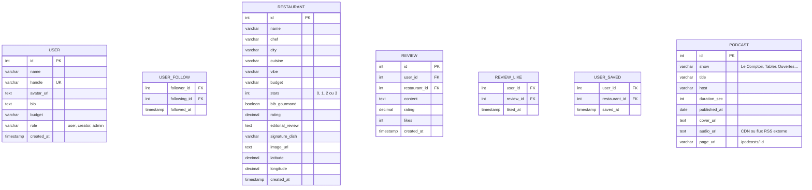

# Michelin Guide — Schéma de Base de Données

```mermaid
erDiagram

  USER {
    int       id            PK
    varchar   name
    varchar   handle        UK
    text      avatar_url
    text      bio
    varchar   budget
    varchar   role          "user, creator, admin"
    timestamp created_at
  }

  USER_FOLLOW {
    int       follower_id   FK
    int       following_id  FK
    timestamp followed_at
  }

  RESTAURANT {
    int       id            PK
    varchar   name
    varchar   chef
    varchar   city
    varchar   cuisine
    varchar   vibe
    varchar   budget
    int       stars         "0, 1, 2 ou 3"
    boolean   bib_gourmand
    decimal   rating
    text      editorial_review
    varchar   signature_dish
    text      image_url
    decimal   latitude
    decimal   longitude
    timestamp created_at
  }

  REVIEW {
    int       id            PK
    int       user_id       FK
    int       restaurant_id FK
    text      content
    decimal   rating
    int       likes
    timestamp created_at
  }

  REVIEW_LIKE {
    int       user_id       FK
    int       review_id     FK
    timestamp liked_at
  }

  USER_SAVED {
    int       user_id       FK
    int       restaurant_id FK
    timestamp saved_at
  }

  PODCAST {
    int       id            PK
    varchar   show          "Le Comptoir, Tables Ouvertes…"
    varchar   title
    varchar   host
    int       duration_sec
    date      published_at
    text      cover_url
    text      audio_url     "CDN ou flux RSS externe"
    varchar   page_url      "/podcasts/:id"
  }

```
